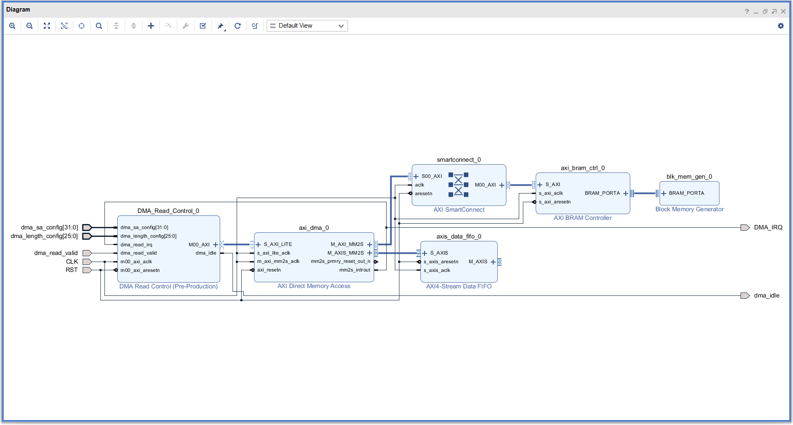
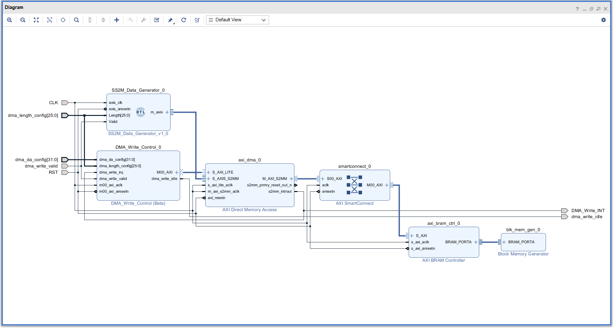
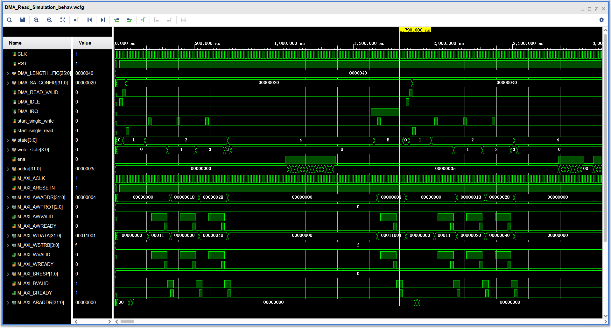
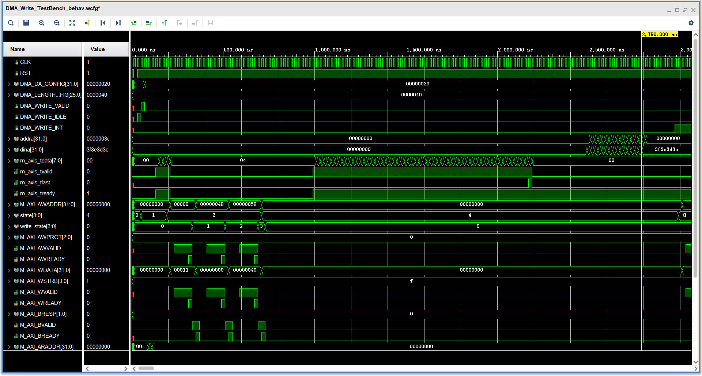

# AXI DMA Controller Implementation

This project develops AXI DMA controllers to facilitate data transfers between the CPU/PS and FPGA/PL using DDR memory.

It follows the programming guide for AXI DMA as outlined in [PG021 AXI DMA](https://www.xilinx.com/support/documentation/ip_documentation/axi_dma/v7_1/pg021_axi_dma.pdf)

## Design Overview
The design uses state machines to control AXI read/write operations following the official programming sequence:

### DMA Read Operation:
   - Verify DMA idle status
   - Configure interrupt settings (completion interrupt enabled)
   - Set source address (MM2S_SA register)
   - Set transfer length (MM2S_LENGTH register)

### DMA Write Operation:
   - Similar sequence with different register addresses
   - Follows S2MM channel programming sequence

### Implementation Details
- State Machine: Controls AXI operation states
- Counter: Manages AXI write addresses and content
- Address Alignment: Supports 4-byte alignment when DRE disabled

## Simulation Environment

### Test Setup
The simulation environment includes:
- AXI Smart Connect
- AXI DMA
- AXI4-Stream Data FIFO
- AXI BRAM Controller
- Block RAM Generator (BRAM Controller mode)

### Block Diagrams
#### DMA Read Configuration

#### DMA Write Configuration

### Simulation Results
#### DMA Read Operation

#### DMA Write Operation

